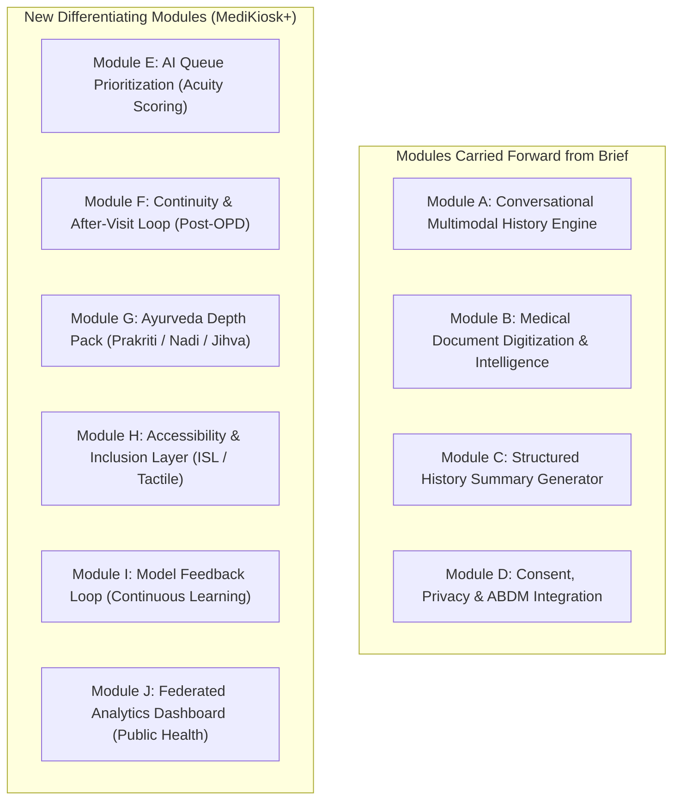
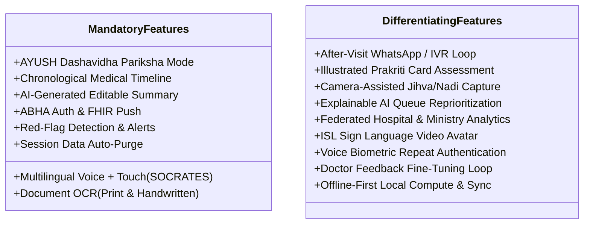
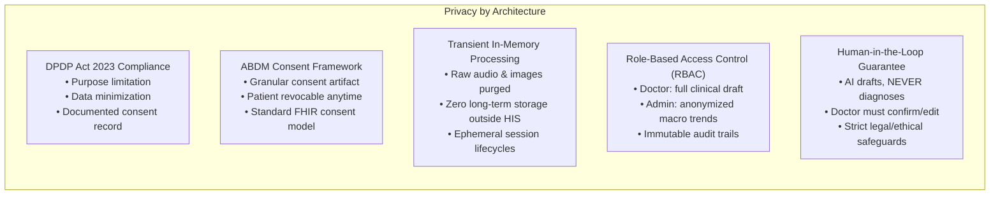
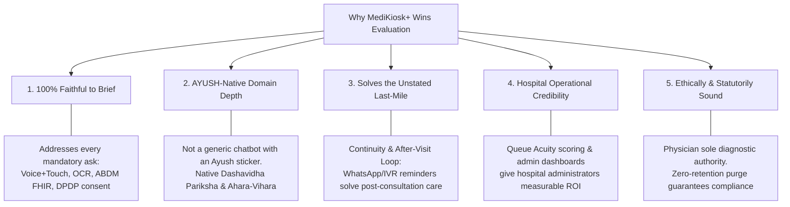

# MediKiosk / MediKiosk+: Complete Problem Statement & Solution Blueprint

> **Comprehensive Reference Document**  
> Synthesized from:
> 1. **Official Problem Statement Brief (Problem Statement 4)** – *Ministry of Ayush / All India Institute of Ayurveda (AIIA)*
> 2. **MediKiosk Project Report** – *AI-Powered Clinical History & Document Intelligence Platform (PS ID: 26047)*
> 3. **Smart India Hackathon (SIH) Solution Blueprint** – *MediKiosk+: The AI Front Door to Every Consultation*

---

## 1. Metadata & Identification

| Field | Detail |
| :--- | :--- |
| **Problem Statement ID** | `26047` (Problem Statement 4) |
| **Problem Statement Title** | Patient Case-Taking Software |
| **Organization (Ministry)** | Ministry of Ayush |
| **Department / Apex Institution**| All India Institute of Ayurveda (AIIA) |
| **Category** | Software |
| **Theme** | MedTech / BioTech / HealthTech |
| **Solution Designations** | **MediKiosk** (Baseline Platform) / **MediKiosk+** (Enhanced Hackathon Solution Blueprint) |
| **Target Ecosystem** | Ayushman Bharat Digital Mission (ABDM), ABHA Health IDs, HL7 FHIR Interoperability Standards, Hospital Information Systems (HIS / EMR) |
| **Official Links Provided** | YouTube / Video Link: NA \| Dataset Link (Real/Dummy): NA |

---

## 2. Complete Problem Statement Breakdown

### 2.1 The Clinical History-Taking Bottleneck in Indian Hospitals

#### The Foundational Role of History-Taking
In clinical medicine, **history-taking** is systematically defined as the structured elicitation of:
1. **Chief Complaint (CC)**
2. **History of Present Illness (HPI)**
3. **Past Medical and Surgical History**
4. **Drug and Allergy History**
5. **Family History**
6. **Personal and Social History**
7. **Review of Systems (ROS)**

Classical clinical teaching establishes that a well-conducted medical history yields the **correct diagnosis in 70% to 80% of clinical cases**, even before a physician performs a physical examination or orders diagnostic laboratory investigations.

#### The Indian OPD Reality & Time Compression
India operates one of the most patient-dense healthcare delivery systems in the world:
- **Patient Volume:** Overburdened public hospital Outpatient Departments (OPDs), particularly tertiary government hospitals and apex medical institutions, routinely register between **4,000 and 10,000 patients per day**.
- **Consultation Window:** The doctor-to-patient consultation time is compressed to an unsustainable **2 to 5 minutes** per patient.
- **Global Benchmark Comparison:** A landmark 2017 *BMJ Open* study across 67 countries placed India's average primary-care consultation duration at **just over two minutes (approx. 120 seconds)**, among the absolute shortest in the world.

#### The Clinical Fall-Out
Within this tiny 2-to-5 minute window, a physician is expected to simultaneously:
- Elicit the patient's comprehensive history
- Conduct a physical examination
- Review past paper records and investigation reports
- Formulate a differential/provisional diagnosis
- Counsel the patient and their attendants
- Write prescriptions and clinical orders

Under this extreme time pressure, **history-taking is invariably the first casualty**. This systemic compression directly causes:
- Incomplete and rushed clinical histories
- Missed chronic comorbidities and drug interactions
- Redundant and repetitive questioning across repeat visits
- Avoidable diagnostic delays and medical errors

---

### 2.2 The AYUSH-Specific Dimension

The clinical intake crisis is severely compounded in **Ayurvedic and AYUSH Outpatient Departments**. Ayurvedic clinical diagnosis is holistically individualized and structurally far heavier than modern allopathic intake. Classical Ayurvedic methodology requires multi-tier pariksha frameworks:

```mermaid
graph TD
    A["Ayurvedic Diagnostic Assessment Framework"] --> B["Trividha Pariksha<br/>(Threefold Examination)"]
    A --> C["Ashtavidha Pariksha<br/>(Eightfold Examination)"]
    A --> D["Dashavidha Pariksha<br/>(Tenfold Examination)"]
    A --> E["Etiological & Pathological Inquiry"]

    B --> B1["Darshana (Inspection)"]
    B --> B2["Sparshana (Palpation)"]
    B --> B3["Prashna (Questioning/History)"]

    C --> C1["Nadi (Pulse)"]
    C --> C2["Mutra (Urine)"]
    C --> C3["Mala (Stool)"]
    C --> C4["Jihva (Tongue)"]
    C --> C5["Shabda (Voice/Speech)"]
    C --> C6["Sparsha (Touch/Skin)"]
    C --> C7["Druk (Eyes/Vision)"]
    C --> C8["Akriti (General Appearance)"]

    D --> D1["1. Prakriti (Baseline Constitution)"]
    D --> D2["2. Vikriti (Current Morbidity/Imbalance)"]
    D --> D3["3. Sara (Tissue Purity/Excellence)"]
    D --> D4["4. Samhanana (Compactness of Body)"]
    D --> D5["5. Pramana (Anthropometric Proportions)"]
    D --> D6["6. Satmya (Habituation & Adaptability)"]
    D --> D7["7. Sattva (Mental Strength & Temperament)"]
    D --> D8["8. Ahara Shakti (Digestive & Intake Power)"]
    D --> D9["9. Vyayama Shakti (Physical Exercise Capacity)"]
    D --> D10["10. Vaya (Age / Stage of Life)"]

    E --> E1["Agni (Digestive Capacity)"]
    E --> E2["Koshtha (Bowel Nature)"]
    E --> E3["Ahara-Vihara (Dietary & Lifestyle Patterns)"]
    E --> E4["Nidana (Causative/Etiological Factors)"]
    E --> E5["Samprapti (Pathogenesis/Disease Progression)"]
```



#### The Impossibility in Government OPDs
Capturing this extensive depth manually within a 2-to-5 minute OPD consultation slot is physically impossible. As a direct consequence, practitioners are forced to drastically abbreviate the very assessment parameters that define personalized Ayurvedic healthcare (*Chikitsa*).

---

### 2.3 The Records Fragmentation Problem

Compounding the severe time constraint is the chaotic physical state of patient records:
1. **Unstructured Physical Carry-Ins:** Patients present with physical paper prescriptions, diagnostic lab reports, discharge summaries, and imaging films accumulated from multiple prior private and public healthcare providers.
2. **Chaos & Disorder:** These documents are handwritten, written in varying regional and national languages, torn, faded, and chronologically disordered.
3. **Manual Sifting:** The physician must manually shuffle and read through this pile of physical paperwork during the consultation window, further slashing the time available for patient communication and examination.
4. **Lack of Point-of-Entry Ingestion:** Indian hospitals possess no point-of-entry mechanism to scan, digitize, extract, structure, and chronologically timeline prior medical records before the patient steps inside the consultation cabin.

#### The National Health Digital Backbone & The "First-Mile" Gap
Under the **Ayushman Bharat Digital Mission (ABDM)**, the Government of India has created a national digital health architecture comprising:
- **ABHA (Ayushman Bharat Health Account)** 14-digit IDs and ABHA Addresses
- **Unified Health Information Exchange (HIE / HIE-CM)**
- **HL7 FHIR-based interoperability standards** for electronic health data exchange

**The Unsolved "First-Mile" Bottleneck:** Despite ABDM's national infrastructure, there is no efficient, patient-facing software platform at the hospital entrance that captures structured clinical history and digitizes physical documents directly into the ABDM ecosystem prior to the clinical encounter.

---

### 2.4 Why the Ministry Frames This as a "Software Platform" (Not Just a Mobile App)

The Ministry of Ayush and All India Institute of Ayurveda deliberately framed the requirement as a **Software Platform** rather than an isolated mobile phone app, and specifically mandated integration with the ABDM ecosystem (ABHA, HIE, FHIR). This signals three critical structural realities:
1. **Inclusion of Non-Tech/Marginalized Demographics:** It must work for walk-in, first-visit, no-smartphone, elderly, rural, and low-literacy patients who constitute the overwhelming majority of public hospital OPD queues.
2. **National Health Ecosystem Integration:** It cannot exist as an isolated island app; it must integrate with the hospital's Hospital Information System (HIS/EMR) and push data directly into the patient's ABHA Personal Health Record (PHR) using standard HL7 FHIR specifications.
3. **Dual Clinical Grammar Execution:** It must natively and simultaneously execute two fundamentally different clinical grammars within a single adaptive engine:
   - Modern allopathic **Review of Systems (ROS)** and **SOCRATES** symptom exploration
   - Classical Ayurvedic **Dashavidha Pariksha** and **Ahara-Vihara** intake

---

### 2.5 Gap Analysis of Existing Solutions

| Existing Approach | What It Actually Does | Why It Falls Short & Fails the Brief |
| :--- | :--- | :--- |
| **Hospital Registration Kiosks** | Captures basic demographic and appointment queue data (Name, age, sex, department, token/OPD slip generation). | Captures **zero clinical history**, has zero document intelligence, and performs no clinical triage. |
| **Mobile Health Apps / Tele-Triage Bots** | Chat-based symptom intake questionnaires on a personal smartphone. | Demands smartphone ownership, active 4G/5G data plans, app installation, digital literacy, and pre-visit onboarding. **Excludes elderly, rural, low-literacy, and emergency walk-in patients.** |
| **Manual Nurse-Led Triage Desks** | Human clinical history-taking and vital sign collection at hospital reception. | Cannot scale past a few hundred patients per day; completely overwhelmed by 4,000–10,000 daily patients, recreating the exact same human staffing and transcription bottleneck. |
| **Generic Document Scanner Apps** | Scans paper documents into flat PDF or JPEG image files. | Flat image capture only; does not perform medical OCR, does not extract clinical entities (drugs, dosages, abnormal lab ranges), does not create a chronological medical timeline, and lacks ABHA/FHIR linkage. |

> **Judging & Evaluation Insight from AIIA:**  
> Evaluators from the All India Institute of Ayurveda will specifically evaluate how deeply a team understands **Ayurvedic clinical intake**. A generic allopathic medical chatbot with an Ayurveda label tacked on will be rejected. Genuine depth on **Dashavidha Pariksha**, **Ahara-Vihara**, and Ayurvedic constitution assessment is the primary competitive differentiator.

---

### 2.6 The Precise Problem Definition (Formal Brief)

> *"There is no purpose-built, patient-facing software platform that enables patients to independently and comprehensively record their medical history — through both natural spoken conversation and guided touchscreen interaction — and simultaneously digitize their existing physical medical documents, generating a structured, physician-ready clinical history summary that integrates with the hospital information system (HIS) and the ABDM ecosystem before the patient enters the consultation room."*

---

### 2.7 Core Challenges a Solution Must Overcome

1. **Multilingual, Multi-Accent Voice Capture in High-Noise Environments:** Robust speech recognition across Hindi, English, and major Indian regional languages despite loud hospital background noise, varied accents, dialects, and differing patient speech patterns.
2. **Extreme Accessibility for Low-Literacy & Elderly Users:** Intuitive, icon-driven user interface paired with synchronous audio guidance and conversational voice prompts, allowing a first-time, illiterate, or non-tech-savvy patient to navigate intake with zero training.
3. **Accurate Clinical Structuring of Free-Form Narration:** Transforming unstructured, emotional, rambling patient voice narrations into standardized, concise, physician-ready clinical summaries (Chief Complaint, HPI, Past History, Medications/Allergies, Family, Personal, ROS, and Dashavidha Pariksha).
4. **Reliable Multilingual Medical Document OCR:** Accurately digitizing both typed and handwritten doctor prescriptions, multi-format laboratory reports, and hospital discharge summaries, with intelligent entity extraction of diagnoses, drugs, strengths, dosages, and numerical lab values.
5. **Strict Statutory Privacy, Consent, and Security Compliance:** Adherence to India's **Digital Personal Data Protection (DPDP) Act 2023** and the **ABDM Consent Framework**, ensuring purpose limitation, granular audio-explained consent, secure transient processing, and immediate post-session data purging.

---

## 3. The Proposed Solutions: MediKiosk & MediKiosk+

### 3.1 Solution Vision & Core Principles

#### One-Line Pitch
> **"MediKiosk+ turns the 5 minutes a doctor doesn't have into 5 minutes the patient already spent productively — talking, tapping, and scanning in their own language, before they ever sit down."**

#### Foundational Design Principles

```mermaid
flowchart LR
    P1["1. Zero-Training Usability<br/>(Non-literate 70yo completes unaided)"]
    P2["2. Dual-Mode Interaction<br/>(Every question voice OR touch)"]
    P3["3. Physician-in-the-Loop<br/>(AI drafts; physician confirms/edits)"]
    P4["4. Dual Clinical Grammar<br/>(SOCRATES + Dashavidha Pariksha)"]
    P5["5. Safety-First Triage<br/>(Red-flag emergency escalation)"]
    P6["6. Offline-First Resiliency<br/>(Works without internet, deferred sync)"]
    P7["7. Privacy by Architecture<br/>(DPDP 2023, ABDM consent, purge)"]

    P1 --- P2 --- P3 --- P4 --- P5 --- P6 --- P7
```



1. **Zero-Training Usability:** A 70-year-old, first-time, non-literate, non-tech-savvy patient must be able to complete intake unaided.
2. **Dual-Mode Interaction:** Every question is answerable either by speaking naturally or by tapping visual icons on screen, ensuring neither illiteracy nor hearing difficulty becomes a barrier.
3. **Physician-in-the-Loop Control:** The AI never provides an autonomous clinical diagnosis. The AI output is strictly a clinical draft summary that requires explicit physician review, editing, and confirmation before entering the medical record.
4. **Dual Clinical Grammar:** The same conversational engine natively speaks fluent allopathic **SOCRATES** logic and classical Ayurvedic **Dashavidha Pariksha**, dynamically switched by OPD department selection.
5. **Safety-First Triage:** Life-threatening red-flag symptoms (acute chest pain, dyspnea, stroke signs) are identified in real-time, instantly bypassing the standard OPD queue to alert clinical triage staff.
6. **Works Where Connectivity Doesn't (Offline-First):** Kiosks deployed in rural or semi-urban AYUSH facilities run core speech, intake, and OCR workflows on local compute, queuing data with end-to-end encrypted deferred synchronization once network connectivity returns.
7. **Privacy by Architecture (Not Just Policy):** Data minimization, granular audio-explained consent, ephemeral in-memory processing, and automated session purges fully align with statutory DPDP 2023 mandates.

---

### 3.2 System Architecture

The software architecture is structured across high-level operational layers that process data from physical patient input to national health record persistence:

```mermaid
graph TB
    subgraph L1 ["1. Patient-Facing Presentation Layer (Kiosk Hardware / Web)"]
        K1["Touchscreen Kiosk / Tablet UI"]
        K2["Document Scanner / HD Camera Feed"]
        K3["Web / Mobile Companion Link (QR Handoff)"]
        K4["IVR Fallback Channel (Feature Phones)"]
        K5["Braille / Tactile Buttons & Voice Biometrics"]
    end

    subgraph L2 ["2. Multimodal Interaction Layer"]
        I1["Indic ASR Engine (Bhashini / AI4Bharat)"]
        I2["Indic TTS Voice Prompts (Local Languages)"]
        I3["Conversational Dialogue Manager"]
        I4["Sign-Language Video Avatar (ISL)"]
    end

    subgraph L3 ["3. Clinical Intelligence Layer"]
        C1["Ontology-Constrained LLM Engine"]
        C2["Allopathic SOCRATES History Branching"]
        C3["AYUSH Dashavidha & Prakriti Engine"]
        C4["Document OCR (Layout-Aware + Handwriting)"]
        C5["Medical NER (Drugs, Diagnoses, Labs)"]
        C6["Red-Flag & Acuity Scoring Classifier"]
        C7["Clinical Summarization Engine (FHIR-Aligned)"]
    end

    subgraph L4 ["4. Backend & Integration Layer"]
        B1["Application Server (Node.js / FastAPI)"]
        B2["Transient Encrypted Session Store"]
        B3["Consent Ledger & DPDP Purge Engine"]
        B4["FHIR R4 Adapter & ABDM / ABHA SDK"]
        B5["Hospital Information System (HIS / EMR) Adapter"]
        B6["Notification Gateway (WhatsApp / SMS / IVR)"]
    end

    subgraph L5 ["5. Hospital & National Ecosystem Layer"]
        E1["Hospital EMR / HIS Clinical Database"]
        E2["Doctor's Consultation Room Console"]
        E3["Live OPD Triage & Queue Monitor"]
        E4["ABDM Health Information Exchange (HIE-CM)"]
        E5["Patient's ABHA Personal Health Record (PHR)"]
        E6["Federated Admin & Ministry Analytics Dashboard"]
    end

    L1 --> L2
    L2 --> L3
    L3 --> L4
    L4 --> L5
```



---

### 3.3 The 10 Solution Modules (Comprehensive Suite)

The solution incorporates the 4 core modules specified in the original brief (Modules A–D) and expands them with 6 cutting-edge differentiating modules (Modules E–J) introduced in the MediKiosk+ blueprint:



#### Module A — Conversational Multimodal History Engine
- **Dual-Mode Intake:** Synchronous natural speech and visual touchscreen interface. Patients speak in their mother tongue or tap large pictorial buttons.
- **SOCRATES Symptom Probing:** When a symptom like pain is reported, the dialogue manager systematically probes:
  - **S**ite (exact anatomical location)
  - **O**nset (acute vs. gradual, triggers)
  - **C**haracter (stabbing, burning, aching, throbbing, dull)
  - **R**adiation (moves to neck, arm, back, etc.)
  - **A**ssociations (nausea, diaphoresis, vomiting, fever)
  - **T**ime course / Timing (constant, intermittent, worse at night)
  - **E**xacerbating / Relieving factors (food, exertion, rest, position)
  - **S**everity (scale 1–10 visual analog scale)
- **AYUSH Mode:** Automatically extends clinical inquiries to capture the 10 **Dashavidha Pariksha** parameters (Prakriti, Vikriti, Sara, Samhanana, Pramana, Satmya, Sattva, Ahara Shakti, Vyayama Shakti, Vaya) and lifestyle patterns (**Ahara-Vihara**).
- **Real-Time Red-Flag Detection:** Continuously evaluates conversational utterances against clinical emergency rules (e.g., crushing substernal chest pain + radiation to jaw/left arm + shortness of breath; facial droop + unilateral weakness). Immediately fires priority alerts to hospital emergency triage staff.

#### Module B — Medical Document Digitization & Intelligence
- **Multimodal Capture:** HD camera feed or document scanner captures prior physical prescriptions, discharge cards, laboratory reports, and radiology summaries.
- **Specialized Medical OCR:** Layout-aware optical character recognition combining cloud vision and local fine-tuned handwriting recognition models capable of reading unstructured physician handwriting.
- **Intelligent Clinical Entity Extraction (NER):** Extracts and tags:
  - Diagnoses and chronic conditions (ICD-10 / SNOMED CT)
  - Medications, active ingredients, dosage strengths, and frequency regimens
  - Laboratory test parameters, measured values, units, and standard reference ranges
  - Surgical and intervention history with dates
- **Chronological Timeline & Anomaly Detection:** Arranges fragmented records into a unified chronological medical timeline, flagging out-of-range/critical lab values and alerting clinicians to potential dangerous drug-drug interactions.

#### Module C — Structured History Summary Generator
- **Synthesis:** An LLM-based clinical summarization engine merges patient voice history with extracted document data into a standardized clinical summary:
  $$\text{Chief Complaint} \longrightarrow \text{HPI} \longrightarrow \text{Past Medical/Surgical} \longrightarrow \text{Medications \& Allergies} \longrightarrow \text{Family} \longrightarrow \text{Personal} \longrightarrow \text{ROS} \longrightarrow \text{Prior Investigations}$$
- **Physician-in-the-Loop Control:** Displays directly on the doctor's consultation monitor before the patient enters. The doctor can accept, modify, or reject any drafted clinical statement with one click.
- **Bilingual Output Engine:** Generates a patient-facing audio/text confirmation summary in their spoken regional language, while concurrently rendering a standardized English/Hindi summary formatted for the physician's electronic record.

#### Module D — Consent, Privacy & ABDM Integration
- **ABHA Onboarding & Authentication:** Facilitates instant biometric/OTP authentication of ABHA IDs, or creates a new ABHA ID on the spot for first-time visitors using Aadhaar/mobile.
- **Statutory Consent Layer:** Complies with the **Digital Personal Data Protection (DPDP) Act 2023** and ABDM Consent Artifact standards. Features audio-explained, granular consent toggles (demographics, clinical intake, document OCR, ABHA exchange).
- **FHIR Interoperability:** Assembles health data into **HL7 FHIR R4 Bundles** (Composition, Condition, MedicationStatement, Observation) and pushes them to the hospital HIS and the patient's ABHA Personal Health Record.
- **Zero-Retention Session Purge:** Clears all temporary voice recordings, video frames, and scanned document images from memory immediately upon completion of data transmission.

#### Module E — AI Queue Prioritization (MediKiosk+ Differentiator)
- Converts raw red-flag triggers into a transparent, explainable **Emergency Acuity Score**.
- Integrates directly with the hospital OPD Token & Queue Management system.
- Automatically reorders the consultation queue, bumping critically ill patients ahead of non-urgent routine consultations, while providing triage nurses with an explainable reason (e.g., *"Patient token #104 bumped: Acute chest pain with dyspnea reported"*).

#### Module F — Continuity & After-Visit Loop (MediKiosk+ Differentiator)
- Closes the post-consultation gap that existing solutions ignore.
- Pushes the physician-approved digital prescription and summary directly into the patient's ABHA Health Locker.
- Dispatches medication schedules, dietary instructions (*Pathya/Apathya* for Ayurveda), and scheduled follow-up reminders in the patient's regional language via **WhatsApp Business API** or **automated IVR phone calls** for non-smartphone owners.

#### Module G — Ayurveda Depth Pack (MediKiosk+ Differentiator)
- **Illustrated Prakriti / Vikriti Self-Assessment:** Visual, card-based touchscreen module allowing non-literate patients to identify constitutional traits (skin type, digestion speed, sleep habits, weather tolerance) by tapping pictures and listening to audio prompts.
- **Ahara-Vihara Diary Capture:** Structured entry of dietary habits, circadian routines, water intake, and physical activity.
- **Non-Diagnostic Pulse/Tongue Image Capture:** Optional high-resolution image capture of the patient's tongue (*Jihva Pariksha*) and pulse region (*Nadi*), explicitly watermarked and flagged as **Research-Data Aid for the Vaidya**, strictly preserving the Ayurvedic physician as the sole diagnostic authority.

#### Module H — Accessibility & Inclusion Layer (MediKiosk+ Differentiator)
- **Indian Sign Language (ISL) Avatar:** Animated sign-language avatar renders all intake questions for deaf and speech-impaired patients.
- **Audio-First Flow & Tactile Navigation:** Full voice-guided conversational navigation paired with high-contrast, large-font UI and Braille-compatible physical tactile keypad inputs for visually impaired patients.
- **Voice-Biometric Repeat Login:** Allows returning rural or elderly patients without identification cards to authenticate rapidly using their unique voiceprint.

#### Module I — Model Feedback Loop (MediKiosk+ Differentiator)
- Implements an active learning pipeline.
- Whenever a treating physician edits, corrects, or rejects any section of the AI-drafted clinical summary, the system logs the delta as an anonymized, labeled training pair.
- These corrections are used to continuously fine-tune the clinical summarization and NER models, creating a system that becomes progressively more accurate after deployment.

#### Module J — Federated Analytics Dashboard (MediKiosk+ Differentiator)
- Aggregates de-identified, anonymized clinical symptoms, seasonal ailment trends, and operational metrics.
- Provides hospital superintendents and the Ministry of Ayush with macro-level epidemiological intelligence, disease outbreak detection, and quantified consultation time-savings metrics.

---

### 3.4 Feature Set: Mandatory vs. Differentiating



#### Mandatory Features (Must Work Flawlessly)
1. **Multilingual Voice + Touch History Capture:** Adaptive follow-up questioning utilizing the SOCRATES framework for allopathic presentations.
2. **AYUSH History Mode:** Comprehensive Dashavidha Pariksha interview covering all ten classical parameters (*Prakriti, Vikriti, Sara, Samhanana, Pramana, Satmya, Sattva, Ahara Shakti, Vyayama Shakti, Vaya*) plus Ahara-Vihara lifestyle ingestion.
3. **Document Scanning & OCR:** High-precision OCR extraction for printed and handwritten prescriptions, lab tests, and hospital discharge summaries.
4. **Chronological Document Timeline:** Automatic assembly of patient history into a structured timeline with out-of-range lab highlighting.
5. **Structured Clinical Summary Generator:** Generates standardized clinical drafts (*CC $\rightarrow$ HPI $\rightarrow$ Past $\rightarrow$ Drugs/Allergies $\rightarrow$ Family $\rightarrow$ Personal $\rightarrow$ ROS $\rightarrow$ Investigations*) that are 100% editable by the doctor.
6. **ABHA Authentication & FHIR Push:** Full integration with ABHA ID login, granular audio-explained consent, and HL7 FHIR API dispatch to the HIS.
7. **Emergency Red-Flag Detection:** Algorithmic identification of acute emergency symptoms triggering immediate clinical triage notifications.
8. **Statutory Session Purge:** Complete deletion of ephemeral voice recordings and document scans immediately post-submission.

#### Differentiating / "Out-of-the-Box" Features
- **Closing the Loop (After-Visit Care):** Multilingual digital summary, prescription, and audio reminders delivered via WhatsApp or automated IVR phone calls for non-smartphone users.
- **Ayurveda-Native Intelligence:** Picture-based card assessment for non-literate constitution determination and non-diagnostic tongue/pulse imagery.
- **Administrative Operational Intelligence:** Dynamic queue reprioritization based on clinical acuity scores and hospital-wide public health analytics.
- **Universal Accessibility & Trust:** Sign-language avatar, voice biometrics, offline-first edge architecture, and physician-correction active learning loops.

---

### 3.5 Consolidated Technology Stack

| Functional Layer | System Component | Recommended / Implemented Technology |
| :--- | :--- | :--- |
| **Kiosk Frontend UI** | Touch + Voice Interactive Interface | React / Flutter (tablet-optimized, large touch targets, offline-capable PWA shell) |
| **Audio Capture & Streaming** | Hardware Audio In/Out | WebRTC / Native Audio APIs with browser-level noise suppression |
| **Speech-to-Text (ASR)** | Indian Language Voice Recognition | **Bhashini** / **AI4Bharat IndicASR** models (fine-tuned for noisy hospital acoustic environments) |
| **Text-to-Speech (TTS)** | Indian Language Voice Prompts | **Bhashini TTS** / **Coqui TTS** (high-naturalness Indic regional voices) |
| **Dialogue Management** | Conversational State Engine | Clinical Ontology-constrained LLM orchestration (integrating SNOMED CT, ICD-10, and Ayush Dashavidha ontology) |
| **Document OCR** | Vision & Text Recognition | Google Cloud Vision / Layout-Aware Tesseract + Custom fine-tuned Indian handwriting recognition models |
| **Clinical NLP & NER** | Medical Entity Extraction | Specialized Medical NLP (spaCy / ClinicalBERT variants / Gemini Multimodal) for diagnoses, drugs, and lab values |
| **Clinical Summarization** | Summary Generation Engine | Fine-tuned LLM with structured JSON / FHIR-aligned output prompting; mandatory physician-in-the-loop review |
| **Interoperability & Standards**| National Health Integration | **HL7 FHIR R4** APIs, ABDM Health Information Exchange (HIE-CM), ABDM Scan-and-Share, ABHA Auth SDK |
| **Backend Core** | Application Services | Node.js / Python (FastAPI) asynchronous microservices; event-driven pipeline (ASR $\rightarrow$ NLU $\rightarrow$ Summarizer $\rightarrow$ FHIR) |
| **Database & Storage** | Persistent & Transient Stores | PostgreSQL (structured clinical metadata) + Encrypted Object Storage (transient scanned files); Redis for session caching |
| **Consent & Compliance** | Statutory Consent Ledger | ABHA OAuth 2.0 integration, immutable DPDP-compliant consent ledger |
| **Patient Notifications** | Outbound Communication | WhatsApp Business API / National SMS Gateway / Automated IVR telephony |
| **Analytics & Surveillance** | Operational & Epidemiological Dashboard | Anonymization and aggregation data pipeline feeding hospital admin and Ministry of Ayush web dashboards |
| **Deployment Infrastructure** | Hosting & Scalability | On-premise hospital edge servers or empanelled secure Indian government cloud (MeitY-compliant, data-residency guaranteed), Docker & Kubernetes containerization |
| **Security & Privacy** | Platform Cyber Defense | End-to-end TLS 1.3 encryption in transit, AES-256 at rest, strict Role-Based Access Control (RBAC), immutable audit logging |

---

### 3.6 End-to-End Patient & Physician Journey

The complete operational flow spans six seamless stages:

```mermaid
sequenceDiagram
    autonumber
    actor P as Patient (Kiosk)
    participant K as MediKiosk Engine
    participant HIS as Hospital HIS / EMR
    actor D as Physician (Cabin)
    participant ABDM as ABDM / ABHA PHR
    participant N as WhatsApp / IVR

    Note over P,K: Step 1: Identify
    P->>K: Scans ABHA / Aadhaar or registers as new walk-in
    K->>P: Delivers audio-guided consent in preferred language
    P->>K: Grants granular consent (voice, documents, records)

    Note over P,K: Step 2: Converse
    K->>P: Conducts adaptive voice + touch clinical interview
    Note right of K: Executes SOCRATES (Allopathic) or Dashavidha Pariksha (AYUSH)
    alt Red-Flag Emergency Detected
        K->>HIS: Elevates Emergency Acuity Score & reprioritizes OPD queue
        K->>D: Sends instant triage priority notification
    end

    Note over P,K: Step 3: Scan
    P->>K: Scans prior prescriptions, lab reports, discharge summaries
    K->>K: Runs OCR, extracts entities, builds chronological timeline, flags abnormals

    Note over K,HIS: Step 4: Summarize & Route
    K->>K: Synthesizes conversational intake + document timeline into FHIR draft
    K->>HIS: Pushes structured clinical draft to Doctor's EMR console
    K->>K: Purges transient voice recordings and scanned images from kiosk memory

    Note over D,P: Step 5: Consult
    D->>HIS: Reviews structured draft in 15-30 seconds
    D->>HIS: Edits, confirms, or amends summary; conducts physical exam & counseling
    HIS-->>K: Physician edits logged to Model Feedback Loop for fine-tuning

    Note over D,N: Step 6: Continue (After-Visit Loop)
    HIS->>ABDM: Pushes signed encounter bundle to Patient ABHA Health Locker
    HIS->>N: Sends digital Rx, dietary instructions & IVR reminders to patient phone
```

1. **Step 1 — Identify:** Patient approaches the kiosk, selects their preferred mother tongue, and authenticates via ABHA QR scan, Aadhaar, or instant walk-in registration. An audio prompt explains data usage in simple terms, and the patient grants granular consent.
2. **Step 2 — Converse:** The AI conducts an adaptive voice and touchscreen interview. For allopathic complaints, it systematically branches through the SOCRATES pain/symptom framework; for AYUSH OPDs, it evaluates the Dashavidha Pariksha parameters and lifestyle habits. If red-flag indicators are recognized, emergency triage alerts immediately reprioritize the queue.
3. **Step 3 — Scan:** The patient places their prior physical medical records under the camera. The system digitizes handwritten and printed papers, extracts clinical entities (medications, past procedures, laboratory results), builds an organized timeline, and highlights abnormal values.
4. **Step 4 — Summarize & Route:** The summarization engine unifies the interview and extracted records into a concise, FHIR-compliant draft summary. This is transmitted securely to the physician's workstation. Kiosk session data is securely purged.
5. **Step 5 — Consult:** When the patient enters the consultation cabin, the physician views the complete, pre-organized clinical history in seconds. Instead of wasting time on repetitive administrative history-taking and sorting papers, the doctor spends the consultation on thorough examination, diagnostic reasoning, and personalized counseling. Edits are recorded to continuously improve the model.
6. **Step 6 — Continue:** Following the consultation, the approved medical record and digital prescription are pushed to the patient's ABHA PHR, and automated audio/text instructions and medication reminders are dispatched via WhatsApp or IVR calls.

---

### 3.7 Privacy, Consent, Security & Statutory Compliance



- **DPDP Act 2023 Alignment:** Adheres to the statutory principles of purpose limitation, data minimization, and lawful data processing. Every intake session generates an encrypted, time-stamped consent record.
- **ABDM Consent Framework Integration:** Integrates with ABDM's Consent Manager. Consent is granular (individual toggles for voice, OCR, historical linkage), audio-explained for non-literate patients, and can be revoked at any time.
- **Session-Scoped Processing & Zero-Retention Purging:** Scanned raw images and raw audio streams are processed transiently in volatile memory. The moment the structured FHIR summary is accepted and transmitted to the hospital HIS and ABDM, all local session artifacts are securely purged.
- **Role-Based Access Control (RBAC):** Only the licensed treating physician assigned to that patient's token number can access the unconfirmed clinical history draft. Hospital administrative staff have access only to de-identified, aggregated operational dashboards.
- **Ethical Human-in-the-Loop Guarantee:** The platform is legally, ethically, and architecturally positioned as a **documentation, organization, and triage-support tool** — never an autonomous diagnostic system. This design guarantees patient safety and satisfies medical regulatory requirements.

---

### 3.8 Hackathon Build Roadmap (24–36 Hour Plan)

| Phase | Timebox | Target Deliverables & Milestones |
| :--- | :--- | :--- |
| **Phase 0: Scope Lock & Personas** | Hour 0–2 | Finalize target patient personas (1 allopathic emergency/routine persona + 1 AYUSH chronic persona). Lock the exact JSON/FHIR clinical summary schema. |
| **Phase 1: Core Conversational Flow** | Hour 2–8 | Implement dual-mode voice + touch intake for primary chief complaints (e.g., chest pain / dyspepsia) with adaptive SOCRATES branching across 2 languages (Hindi & English). |
| **Phase 2: Document Digitization** | Hour 8–14 | Build OCR ingestion pipeline using 3–4 sample handwritten/printed prescriptions and lab reports; execute medical entity extraction and render chronological timeline view. |
| **Phase 3: Clinical Summary Engine** | Hour 14–20 | Merge conversational intake data and extracted OCR records into the standardized, editable physician-facing clinical summary console. |
| **Phase 4: AYUSH Mode & Differentiators**| Hour 20–26 | Implement Dashavidha Pariksha card-based UI; connect red-flag triggers to OPD queue reprioritization; build after-visit WhatsApp/IVR mock loop. |
| **Phase 5: Integration & Polish** | Hour 26–30 | Connect mock ABHA authentication, FHIR R4 Bundle generation, audio-explained consent screens, and offline-mode toggle simulation. |
| **Phase 6: Rehearsal & Pitch Deck** | Hour 30–36 | End-to-end rehearsals, refine judge-facing narrative, and record a high-definition backup demonstration video covering the entire patient-to-doctor flow. |

> **Demo Safety Net Protocol:**  
> A pristine, end-to-end video recording of the complete system flow must be captured by Hour 30. Live ASR and handwriting OCR demonstrations are the most common technical failure points during hackathon presentations due to network jitter or ambient venue noise. A pre-recorded video ensures zero presentation failure.

---

### 3.9 Key Risks & Mitigations Matrix

| Identified Technical / Operational Risk | Severity | Engineered Mitigation Strategy |
| :--- | :---: | :--- |
| **ASR Degradation in High-Noise OPDs & Regional Accents** | **High** | Dual-mode fallback architecture: every voice prompt has matching tap-to-select visual buttons on screen. Implement noise-cancellation audio filters, fine-tune ASR on Indian hospital audio, and provide confirm-back audio loops. |
| **OCR Failure on Illegible Doctor Handwriting** | **High** | Implement confidence-scored entity extraction. Extracted medications and findings with confidence scores below 85% are highlighted with a manual-correction review screen shown to the patient or triage assistant prior to submission. |
| **Patients Without ABHA Health ID or Smartphone** | **Medium** | Embedded on-the-spot ABHA generation workflow directly inside Step 1 using Aadhaar biometric/OTP, with an instant graceful fallback to token-based walk-in demographic registration. |
| **Clinician Automation Bias / Over-Trust in AI Summary** | **High** | The AI summary is architecturally prevented from auto-saving. A physical or digital "Review & Confirm" action with mandatory validation checkboxes is enforced before data commits to the EMR. |
| **Network Dropouts & Connectivity Failure in Rural OPDs** | **Medium** | Offline-first Progressive Web App (PWA) kiosk architecture. Conversational dialogue and on-device OCR operate locally on edge hardware, queuing encrypted records for deferred synchronization once internet connectivity restores. |

---

### 3.10 Why This Solution Wins: Strategic Evaluation Alignment



1. **100% Faithful to Problem Statement 26047:** Fulfills every single requirement specified by the Ministry of Ayush — dual-mode interaction, AYUSH clinical frameworks, document digitization, ABDM/FHIR interoperability, and DPDP-compliant consent.
2. **AYUSH-Native, Not AYUSH-Adjacent:** Rather than wrapping a standard allopathic symptom checker in Ayurvedic terminology, MediKiosk+ builds classical Ayurvedic clinical frameworks directly into its dialogue state machine:
   - Evaluates **Prakriti**, **Vikriti**, **Agni**, **Koshtha**, and all ten **Dashavidha Pariksha** factors
   - Deeply models dietary and lifestyle triggers (**Ahara-Vihara** and **Nidana**)
   - Captures non-diagnostic tongue and pulse visual aids to assist the Vaidya
3. **Solves the Complete Cycle (Beyond Check-In):** While competing solutions stop at patient check-in, MediKiosk+ closes the loop with post-consultation digital prescriptions, multi-lingual WhatsApp delivery, and voice-based IVR reminders for patients without smartphones.
4. **Operationally Credible for Hospital Administrators:** By transforming emergency red-flag detection into an automated, explainable queue reprioritization mechanism, it directly improves patient safety metrics, prevents waiting-room mortality, and provides hospital superintendents and the Ministry of Ayush with real-time public health data.
5. **Ethically & Legally Impeccable:** By strictly positioning the AI as a clinical documentation assistant and maintaining the licensed medical practitioner as the sole diagnostic decision-maker, it eliminates malpractice liabilities, respects medical ethics, and ensures rapid institutional adoption.

---

## 4. Synthesis & Conclusion

**MediKiosk / MediKiosk+** directly solves the acute crisis of the 2-minute OPD consultation bottleneck in Indian government and AYUSH healthcare institutions. By migrating time-consuming clinical history elicitation, records sifting, and document digitization to an accessible, multimodal, patient-facing kiosk at the hospital entrance, it fundamentally reclaims consultation time. 

The physician receives a structured, verified, bilingual clinical summary before the patient sits down. As a result, the scarce consultation window is returned to what human doctors do best: **careful physical examination, empathetic patient communication, clinical reasoning, and personalized healing.**

